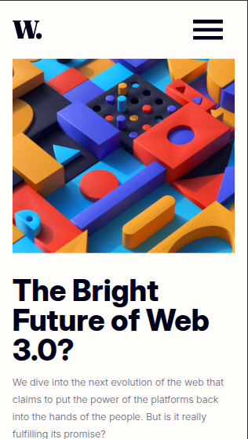
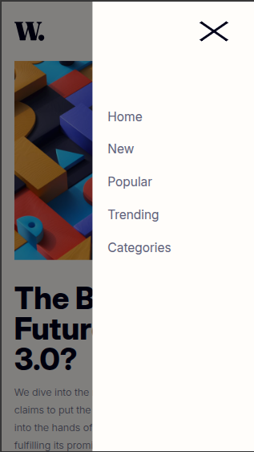
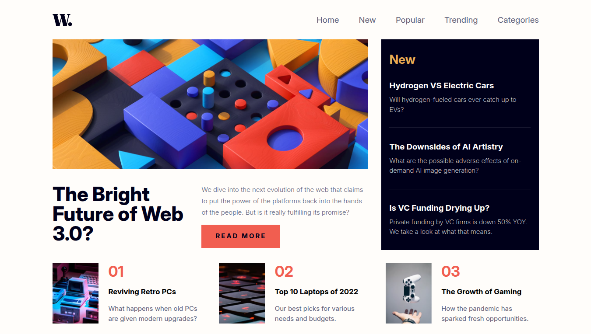

# Frontend Mentor - News homepage solution

This is a solution to the [News homepage challenge on Frontend Mentor](https://www.frontendmentor.io/challenges/news-homepage-H6SWTa1MFl). Frontend Mentor challenges help you improve your coding skills by building realistic projects.

## Table of contents

- [Overview](#overview)
  - [The challenge](#the-challenge)
  - [Screenshot](#screenshot)
  - [Links](#links)
- [My process](#my-process)
  - [Built with](#built-with)
  - [What I learned](#what-i-learned)
- [Author](#author)

## Overview

### The challenge

Users should be able to:

- View the optimal layout for the interface depending on their device's screen size
- See hover and focus states for all interactive elements on the page

### Screenshot

### Links

- Solution URL: [Github repo URL](https://github.com/frontend-rustyff12/15-news-homepage)

- Live Site URL: [Add live site URL here](https://news-homepage-rustyff12.netlify.app/)

## My process

### Built with

- Semantic HTML5 markup
- CSS custom tailwind properties
- Flexbox
- CSS Grid
- Mobile-first workflow
- Tailwind CSS
- [React](https://reactjs.org/) - JS library

### What I learned

Learning how to make a mobile nav in tailwind whilst doing it in react and passing state was a good challenge

## Author

- Frontend Mentor - [@rustyff12](https://www.frontendmentor.io/profile/rustyff12)
